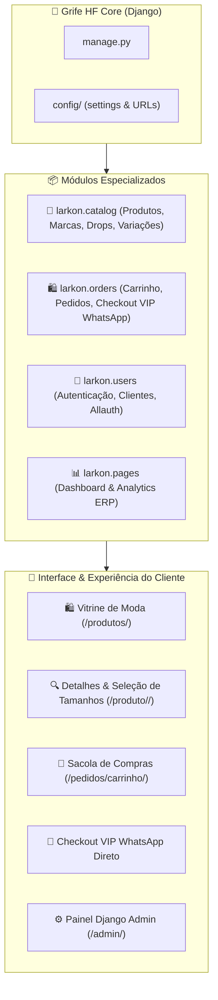

<div align="center">

# ✨ Grife HF — Moda Multimarcas (Feminino & Masculino)

[](#)
[](#)
[](#)
[](#)
[](https://www.instagram.com/grifehfmultimarcascz/)
[](https://wa.me/558391650137)

*A **Grife HF** é uma loja de moda multimarcas que oferece peças exclusivas para os públicos feminino e masculino. Com curadoria apurada de marcas parceiras renomadas, seu catálogo é renovado duas vezes por semana, garantindo novidades frequentes e uma experiência de compra sofisticada e atualizada.*

📍 **Endereço Físico:** Rua José Pires Braga 120, Cajazeiras - PB, 58900-000, Brasil  
📱 **Atendimento VIP WhatsApp:** [+55 83 9165-0137](https://wa.me/558391650137)  
📸 **Instagram Oficial:** [@grifehfmultimarcascz](https://www.instagram.com/grifehfmultimarcascz/)

</div>

---

## 🏛️ Arquitetura da Aplicação (Django 5.x)



---

## 🌟 Funcionalidades Principais

1. **Catálogo & Vitrine de Moda Multimarcas**:
   - Segmentação instantânea por gênero (**Feminino**, **Masculino** e **Unissex**).
   - Filtros dinâmicos por **Marcas Parceiras** (*Animale, Osklen, Farm Rio, Reserva, Ricardo Almeida, Schutz*, etc.).
   - Ciclo de **Drops Bi-semanais** com contagem e destaque das novidades da semana.
   - Busca em tempo real por nome, estilo ou composição de tecido.

2. **Ficha Técnica & Variações da Peça**:
   - Galeria de imagens em alta definição.
   - Grade de tamanhos (**PP, P, M, G, GG, 36 a 46**) com controle de estoque unitário por variação.
   - Detalhamento de composição têxtil (*Linho Puro, Seda, Algodão Pima*) e instruções de lavagem.

3. **Sacola de Compras & Checkout Humanizado VIP**:
   - Carrinho persistente (via sessão ou cliente logado).
   - Checkout com cadastro de dados de entrega.
   - **Gerador de Pedido VIP para WhatsApp**: Transforma o pedido em uma mensagem formatada e codificada pronta para envio direto para a equipe de atendimento da Grife HF.

4. **Landing Page Oficial Light & Boutique**:
   - Design minimalista luxuoso em tom claro (*Light Luxury Fashion*).
   - Hero editorial, vitrine dinâmica de novidades, banners de coleções e mapa/endereço da loja em Cajazeiras-PB.
   - **Botão Flutuante do WhatsApp VIP** com animação e disparo direto.

5. **Área de Autenticação & Login Centralizado**:
   - Card centralizado com suporte a login com e-mail, senha, recuperação e login social.
   - Rotas diretas em `/login/` e `/logout/`.

6. **Painel de Gestão & ERP**:
   - Django Admin customizado com inlines de fotos e variações de estoque.
   - Dashboard com relatórios de vendas, estoque e produtos mais visualizados.

---

## 🚀 Como Executar o Projeto Localmente

### 1. Clonar e Acessar o Repositório
```bash
git clone git@github.com:fvier/Vakaria.git
cd Vakaria
```

### 2. Ativar o Ambiente Virtual e Instalar Dependências
```bash
# Criar e ativar o ambiente virtual (Linux/macOS)
python3 -m venv .venv
source .venv/bin/activate

# Instalar dependências
pip install -r requirements.txt
```

### 3. Aplicar Migrações e Criar os Dados de Exemplo (Seed)
```bash
# Executar as migrações do banco de dados
python manage.py migrate

# Popular o catálogo com marcas, drops, peças femininas/masculinas e superuser
python manage.py seed_grife_data
```

> [!NOTE]
> O comando `seed_grife_data` cria automaticamente um superusuário administrativo:
> - **E-mail:** `admin@grifehf.com.br`
> - **Senha:** `admin123`

### 4. Iniciar o Servidor de Desenvolvimento
```bash
python manage.py runserver
```

Acesse no navegador:
- **Vitrine Principal**: [http://localhost:8000/produtos/](http://localhost:8000/produtos/)
- **Marcas Multimarcas**: [http://localhost:8000/marcas/](http://localhost:8000/marcas/)
- **Sacola de Compras**: [http://localhost:8000/pedidos/carrinho/](http://localhost:8000/pedidos/carrinho/)
- **Painel Django Admin**: [http://localhost:8000/admin/](http://localhost:8000/admin/)
- **Dashboard ERP**: [http://localhost:8000/dashboard/](http://localhost:8000/dashboard/)

---

## 📂 Estrutura de Diretórios

```text
Grife HF/
├── manage.py                          # Utilitário de gestão Django
├── requirements.txt                   # Dependências do projeto (Django 5, Pillow, Allauth, etc.)
├── config/                            # Configurações raiz do Django
│   ├── settings/                      # Configurações modulares (base, local, production)
│   ├── urls.py                        # Roteamento global
│   └── wsgi.py                        # Ponto de entrada WSGI
├── larkon/                            # Aplicações e assets
│   ├── catalog/                       # App de Produtos, Marcas, Categorias e Drops
│   │   ├── models.py                  # Brand, Category, Drop, Product, ProductVariant, ProductImage
│   │   ├── views.py                   # ProductGridView, ProductDetailView, BrandListView
│   │   ├── urls.py                    # Rotas públicas do catálogo
│   │   └── admin.py                   # Painel administrativo com inlines
│   ├── orders/                        # App de Carrinho, Pedidos e Checkout VIP
│   │   ├── models.py                  # Cart, CartItem, Order, OrderItem, WhatsApp link generator
│   │   ├── views.py                   # CartView, AddToCartView, CheckoutView, OrderDetailView
│   │   └── urls.py                    # Rotas de sacola e pedidos
│   ├── users/                         # App de Usuários customizado e autenticação
│   ├── pages/                         # App de Dashboard e páginas do tema
│   ├── templates/                     # Templates Jinja/Django (pages, layouts, partials)
│   └── static/                        # CSS, JS, Imagens, Ícones Solar e Boxicons
└── docs/                              # Governança DevOps, ADRs e guias técnicos
```

---

## 📝 Registro de Decisões de Arquitetura (ADRs)

Consulte o arquivo [docs/diretrizes_documentacao.md](./docs/diretrizes_documentacao.md) para as diretrizes de governança e histórico de ADRs do projeto.
