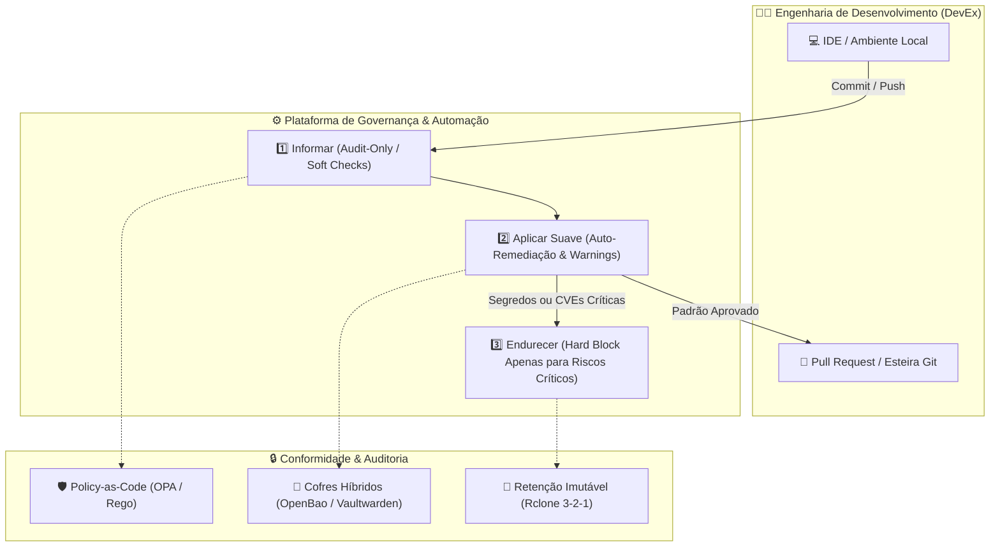
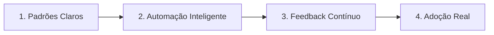
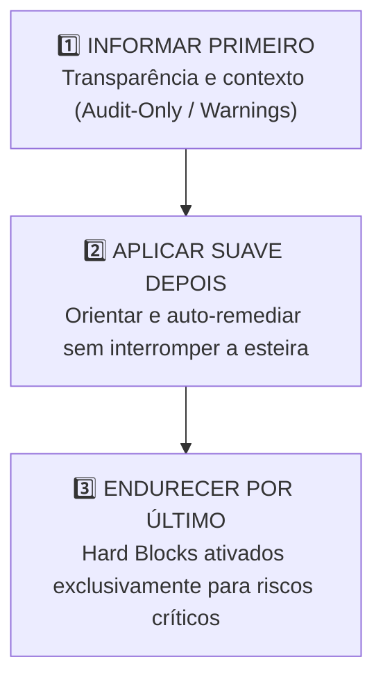

# 🛡️ Compliance & Desenvolvimento: Governança sem Travar o Time

Este documento define as diretrizes técnicas e operacionais para a implementação de **Compliance & Desenvolvimento** no ecossistema de software. O objetivo é estabelecer uma governança de segurança e arquitetura resiliente que **reduza o atrito no fluxo de trabalho** da engenharia, substituindo bloqueios burocráticos por automação inteligente e padrões transparentes (*Golden Paths*).

---

## 📐 Visão Geral & Arquitetura de Governança



---

## Capítulo 1: Fundamentos Executivos & O Dilema do Compliance Clássico

### 1.1 A Falsa Dicotomia: Velocidade vs. Controle
Historicamente, organizações enxergam a segurança e a conformidade regulatória (LGPD, ISO 27001, SOC 2) como o oposto da velocidade de entrega. Essa visão ultrapassada gera dois cenários danosos:
1. **Governança por Parede de Concreto**: Adoção de aprovações manuais extensas, bloqueios arbitrários no CI/CD e formulários em ferramentas de chamados (Jira/ServiceNow) antes de qualquer deploy em ambiente de homologação ou produção.
2. **Engenharia Cega (*Shadow IT*)**: Diante de travas burocráticas, times de produto buscam atalhos operacionais, criando recursos de nuvem não auditados ou contornando varreduras de segurança para cumprir prazos comerciais.

> [!IMPORTANT]
> **Princípio Fundamental:** Automatizar um processo ruim não o transforma em um processo bom; apenas escala o problema. Se uma esteira automatiza o caos, o resultado é uma fábrica de problemas mais eficiente.

### 1.2 Os Mantras da Governança Pragmática
- **Empatia e Clareza**: Governança não é burocracia. É direção com regras transparentes, contexto técnico claro e ferramentas automáticas.
- **Adoção por Simplicidade**: Adoção real não é obediência forçada. O caminho correto e seguro (*Golden Path*) precisa ser, obrigatoriamente, o caminho mais simples e rápido para o desenvolvedor.

---

## Capítulo 2: Diagnóstico de Maturidade & Anti-Padrões de Governança

### 2.1 Matriz Comparativa de Abordagens

| Característica | ❌ Automação Ruim (Fricção e Caos) | ✅ Compliance & Desenvolvimento (Fluidez) |
| :--- | :--- | :--- |
| **Integração no CI/CD** | Workflows manuais e checagens tardias | Validações contínuas desde o commit (*Shift-Left*) |
| **Documentação** | Manuais extensos e desatualizados | Políticas declarativas registradas como código (*Policy-as-Code*) |
| **Momento do Bloqueio** | Interrupção precoce por falhas de baixo impacto | Bloqueios restritos a riscos críticos reais (Segredos/CVEs ativas) |
| **Comunicação** | Alertas genéricos no terminal ou e-mails formais | Feedback contextualizado com orientação de remediação inline no PR |
| **Evolução** | Regras impostas de forma abrupta e global | Introdução gradual e incremental com fases de conscientização |

### 2.2 Os 5 Anti-Padrões Mortais em Produção

1. **Parede de Concreto (*Hard Block* Precoce)**: Bloquear o build ou o deploy em staging devido a vulnerabilidades de severidade baixa ou média em dependências utilizadas unicamente em ambiente de desenvolvimento.
2. **Burocracia em Cascata (*Approval Hell*)**: Exigir aprovações manuais de múltiplos comitês para pipelines que já possuem testes automatizados e validações de infraestrutura passadas.
3. **Obscuridade de Regras (*Shadow Policies*)**: Falhar execuções de código sem apresentar no log a regra exata violada e o passo a passo técnico para sua correção.
4. **Fadiga de Alertas (*Alert Fatigue*)**: Ferramentas SAST/DAST configuradas sem triagem que geram centenas de alertas falsos-positivos, levando os engenheiros a ignorarem os relatórios de segurança.
5. **Compliance de Papel (*Tick-box Security*)**: Focar a conformidade em listas estáticas de auditoria anual em vez de garantir que os controles operem ativamente em tempo de execução (*runtime*).

---

## Capítulo 3: Plataforma como Produto Interno (Golden Paths)

Para que a segurança seja aplicada sem travar os times, a infraestrutura e os padrões de arquitetura devem ser oferecidos como uma **Plataforma Interna de Desenvolvimento (IDP)**.



### 3.1 Ciclo de 4 Etapas da Plataforma
1. **Padrões Claros**: Disponibilizar repositórios com boilerplates pré-configurados contendo arquitetura de arquivos, Dockerfiles otimizados e configurações de segurança recomendadas.
2. **Automação Inteligente**: Executar checagens de validação em segundo plano sem exigir intervenção manual do desenvolvedor.
3. **Feedback Contínuo**: Apresentar os resultados das varreduras diretamente no ambiente em que o desenvolvedor trabalha (comentários no Pull Request ou alertas no canal operacional).
4. **Adoção Real**: Garantir que utilizar os *Golden Paths* seja mais vantajoso e veloz do que criar configurações do zero.

---

## Capítulo 4: O Modelo de Implementação em 3 Passos

A introdução de novos controles de compliance deve seguir um modelo gradual em três estágios para evitar a paralisia das entregas.



### 4.1 Passo 1: Informar Primeiro (Transparência & Contexto)
- **Modo de Operação**: `Audit-Only` ou `continue-on-error: true`.
- **Ação**: As ferramentas de segurança (SAST, Linters, Scanners de contêiner) são executadas na esteira, mas **não interrompem a compilação ou o deploy**.
- **Entrega**: Geração de relatórios e anotações nos Pull Requests informando o débito técnico identificado e explicando o motivo da regra.

### 4.2 Passo 2: Aplicar Suave Depois (Orientação & Auto-Remediação)
- **Modo de Operação**: Remediação Assistida.
- **Ação**: Automações abrem Pull Requests de atualização de dependências automaticamente (via Dependabot ou Renovate) e sugerem correções no próprio diff do código.
- **Entrega**: O time é orientado a corrigir as inconsistências como parte do ciclo normal de refinamento técnico, sem paralisar deploys urgentes.

### 4.3 Passo 3: Endurecer a Governança por Último (Guardrails Rígidos)
- **Modo de Operação**: `Hard Enforcement` (Bloqueio estrito de build/deploy).
- **Ação**: O bloqueio automático é ativado **exclusivamente** para quatro cenários de risco grave indiscutível:
  1. **Segredos no Código**: Presença de chaves de API, tokens ou senhas expostas (validado via Gitleaks ou Trufflehog).
  2. **CVEs Críticas com Exploit Ativo**: Vulnerabilidades registradas no catálogo KEV (*Known Exploited Vulnerabilities*) da CISA ou com score CVSS $\ge 9.0$ com correção disponível.
  3. **Violação de Licenças Proibidas**: Inclusão de dependências com licenças incompatíveis com o modelo do software (ex: GPLv3 em código comercial fechado).
  4. **Contêineres não Assinados**: Tentativa de deploy em produção de imagens Docker que não foram assinadas digitalmente na esteira oficial.

---

## Capítulo 5: Policy-as-Code & Engenharia Prática

As regras de compliance devem ser mantidas no repositório como código declarativo, versionadas via Git e auditáveis a qualquer momento.

### 5.1 Exemplo Prático: Política Rego (Open Policy Agent - OPA)
Abaixo está uma política OPA em linguagem Rego que valida manifestos de implantação Kubernetes/Docker, garantindo que nenhum contêiner execute como usuário `root` e que os limites de recursos estejam definidos.

```rego
# policy/seguranca_container.rego
package compliance.seguranca

default permissao_valida = false
default recursos_definidos = false

# Regra 1: Proibir execução como root
permissao_valida {
    input.kind == "Deployment"
    container := input.spec.template.spec.containers[_]
    container.securityContext.runAsNonRoot == true
}

# Regra 2: Exigir definição explicita de limites de memória e CPU
recursos_definidos {
    input.kind == "Deployment"
    container := input.spec.template.spec.containers[_]
    container.resources.limits.cpu
    container.resources.limits.memory
}

# Decisão final de aprovação
deny[msg] {
    not permissao_valida
    msg := "VIOLAÇÃO DE COMPLIANCE: O contêiner deve ser configurado com 'runAsNonRoot: true'."
}

deny[msg] {
    not recursos_definidos
    msg := "VIOLAÇÃO DE COMPLIANCE: Os limites de CPU e Memória devem ser declarados."
}
```

### 5.2 Validação de Assinatura Digital e SBOM
Para garantir a rastreabilidade da cadeia de suprimentos de software (*Software Supply Chain*):
- **SBOM (Software Bill of Materials)**: Gerado automaticamente no build via ferramentas como Syft (`syft dir:. -o json > sbom.json`).
- **Assinatura de Imagens**: Contêineres gerados na esteira oficial são assinados via Cosign (`cosign sign --key k8s.key minha-imagem:tag`).

---

## Capítulo 6: Gestão de Segredos & Criptografia na Esteira

O vazamento de credenciais é uma das maiores causas de incidentes de segurança. A conformidade exige a eliminação total de senhas estáticas em código e variáveis de ambiente desprotegidas.

### 6.1 Arquitetura *Zero Static Secrets*
- **Credenciais em Código**: Nenhuma senha, chave de API ou token privado deve ser gravado diretamente em arquivos-fonte ou arquivos `.env` commitados.
- **Cofres Híbridos**: Utilização de infraestrutura baseada em **OpenBao** ou **Vaultwarden** para injeção de segredos dinâmicos com tempo de vida limitado (TTL).
- Consulte o manual detalhado em: [infra/cofres_segredos_openbao_vaultwarden.md](./infra/cofres_segredos_openbao_vaultwarden.md).

### 6.2 Governança de Backups Imutáveis (Política 3-2-1)
Conformidade regulatória exige a garantia de recuperação de dados contra desastres e ataques de ransomware:
1. **3 Cópias**: Ambiente local, repositório Git e backup offsite.
2. **2 Meios Diferentes**: Disco local e Cloud Storage (Google Drive / S3).
3. **1 Offsite Criptografado**: Executado via **Rclone Crypt** com chave GPG e canal de notificação de erros no Mattermost/Discord.
- Consulte o guia completo em: [infra/estrategia_backup_rclone_gdrive.md](./infra/estrategia_backup_rclone_gdrive.md) e [docs/politica_backup.md](./docs/politica_backup.md).

---

## Capítulo 7: Métricas de Sucesso, DevEx & Indicadores Executivos

Para medir a eficiência da estratégia de **Compliance & Desenvolvimento**, o sucesso deve ser medido pelo aumento da velocidade com segurança, e não pela quantidade de bloqueios efetuados.

### 7.1 Métricas de Experiência do Desenvolvedor (DevEx)
- **Lead Time for Changes (LTC)**: Tempo transcorrido desde o primeiro commit até o deploy em produção. *Meta: Reduzir ou manter estável após a introdução das checagens.*
- **Taxa de Adoção dos Golden Paths**: Porcentagem de novos projetos iniciados utilizando os templates oficiais pré-aprovados. *Meta: $\ge 85\%$.*
- **Developer Satisfaction Index (DevSAT)**: Avaliação periódica sobre a percepção de atrito nas ferramentas de desenvolvimento.

### 7.2 Métricas de Governança & Risco
- **MTTR (Mean Time to Remediate)**: Tempo médio para aplicação de patches em vulnerabilidades críticas.
- **Ratio de Falsos Positivos**: Percentual de alertas de segurança desconsiderados após análise. *Meta: $< 5\%$.*
- **Audit Readiness (Prontidão para Auditoria)**: Capacidade de demonstrar relatórios de conformidade e trilhas de auditoria instantaneamente via logs automatizados.

---

## Capítulo 8: Checklist Prático de Adoção para Novos Projetos

Ao iniciar um novo produto ou microsserviço, siga o checklist abaixo para garantir a conformidade imediata sem atrito:

- [ ] **Passo 1**: Clonar ou gerar o projeto a partir de um *Golden Path* pré-aprovado.
- [ ] **Passo 2**: Verificar se o arquivo `.gitignore` impede a inclusão acidental de arquivos `.env`, chaves `.pem` ou credenciais locais.
- [ ] **Passo 3**: Confirmar que as varreduras do Gitleaks e Semgrep estão ativas no repositório no modo `Audit-Only`.
- [ ] **Passo 4**: Garantir que os segredos da aplicação sejam injetados via variáveis de ambiente seguras ou cofre de segredos.
- [ ] **Passo 5**: Validar se o contêiner de produção executa com usuário sem privilégios de root (`runAsNonRoot: true`).
- [ ] **Passo 6**: Registrar a rotina de backup offsite 3-2-1 no script oficial de Rclone caso o projeto manipule dados persistentes.

---

## 📑 Documentos Relacionados

- 📖 **[Diretrizes de Documentação & Governança](./diretrizes_documentacao.md)**: Regras formais de escrita técnica e estilo.
- 🚀 **[Estratégia de Execução & Git](./estrategia_execucao.md)**: Fluxo de branches e automação de deploys.
- 🔒 **[Cofres de Segredos (OpenBao + Vaultwarden)](../infra/cofres_segredos_openbao_vaultwarden.md)**: Manual de gestão de credenciais.
- 📦 **[Estratégia de Backup Rclone + GDrive](../infra/estrategia_backup_rclone_gdrive.md)**: Implementação de backups 3-2-1 offsite.
- 🤖 **[Instructions & System Context para IA](./prompt_ia.md)**: Diretrizes permanentes para assistentes de Inteligência Artificial.
